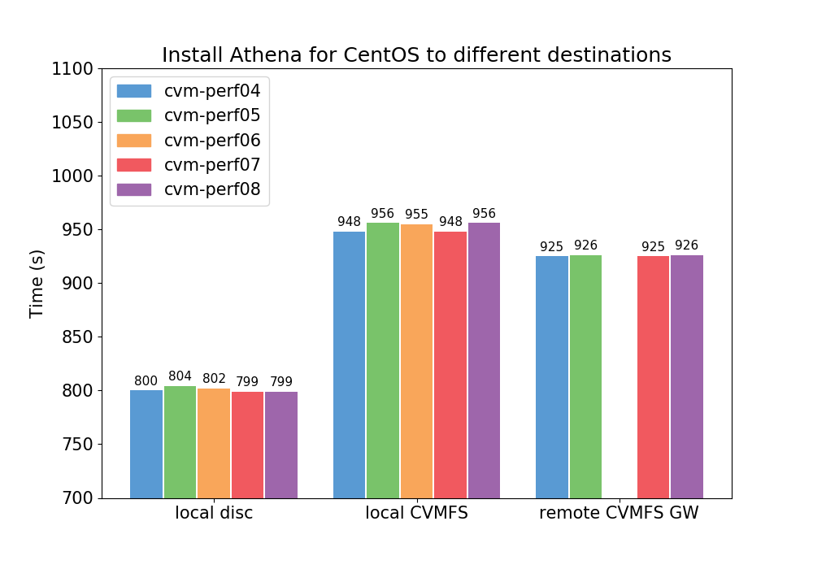
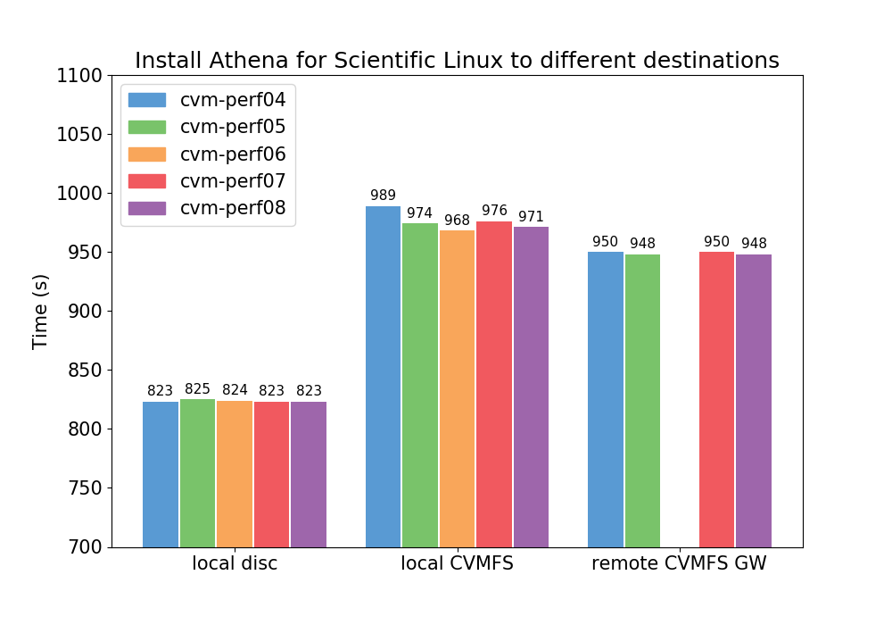
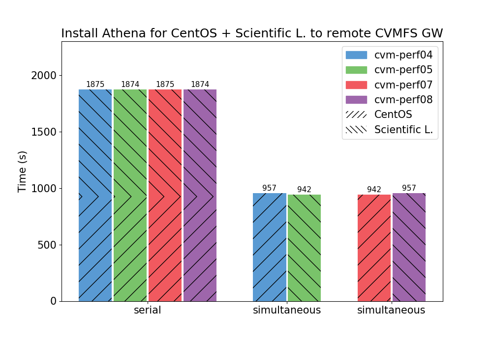

# bench-athena-builds

## Description

The tests are comparing installation time with an ayum command to  destination on a local storage versus destination inside of a CVMFS repository. Also includes tests for a new feature allowing parallel CVMFS transactions from multiple release managers to single gateway.

Packages are downloaded to local repository before the measuring starts. That excludes problems with network instability.

Output of each test is included in the *logs* directory.

The tests were performed on five physical machines: *cvm-perf04 - cvm-perf08* running CentOS 7.5. Each of them has:

  - RAM: 64 GB
  - CPU(s): 32 (16 cores * 2 threads)
    - Model: Intel(R) Xeon(R) CPU E5-2630 v3 @ 2.40GHz
  - HDD: 1 TB
    - Model: SAMSUNG MZ7KM960 Rev: 003Q

---

## Overview





In the plot above, the serial is a sum of two independent tests - *Test 5*, and *Test 6*.

 ---

## Test 1

Install *Athena_22.0.1_x86_64-centos7-gcc62-opt* from *master/x86_64-centos7-gcc62-opt/2018-07-04T2126* to local disc.

##### Prerequisite

```
rm -rf /build /root/rpm_download
yum clean all
mkdir /build
mkdir /root/rpm_download
```

### 1a. (cvm-perf04)

```
[root@cvm-perf04 bench-athena-builds]# ./benchmark.sh -r master/x86_64-centos7-gcc62-opt/2018-07-04T2126 -d /build/athena Athena_22.0.1_x86_64-centos7-gcc62-opt |tee benchmark_1a.log
```

##### Time

```
# TOTAL: 800 seconds   
#     =: 00:13:20 (hh:mm:ss)
```

### 1b. (cvm-perf05)

```
[root@cvm-perf05 bench-athena-builds]# ./benchmark.sh -r master/x86_64-centos7-gcc62-opt/2018-07-04T2126 -d /build/athena Athena_22.0.1_x86_64-centos7-gcc62-opt |tee benchmark_1b.log
```

##### Time

```
# TOTAL: 804 seconds
#     =: 00:13:24 (hh:mm:ss)
```

### 1c. (cvm-perf06)

```
[root@cvm-perf06 bench-athena-builds]# ./benchmark.sh -r master/x86_64-centos7-gcc62-opt/2018-07-04T2126 -d /build/athena Athena_22.0.1_x86_64-centos7-gcc62-opt |tee benchmark_1c.log
```

##### Time

```
# TOTAL: 802 seconds
#     =: 00:13:22 (hh:mm:ss)
```

### 1d. (cvm-perf07)

```
[root@cvm-perf07 bench-athena-builds]# ./benchmark.sh -r master/x86_64-centos7-gcc62-opt/2018-07-04T2126 -d /build/athena Athena_22.0.1_x86_64-centos7-gcc62-opt |tee benchmark_1d.log
```

##### Time

```
# TOTAL: 799 seconds   
#     =: 00:13:19 (hh:mm:ss)
```

### 1e. (cvm-perf08)

```
[root@cvm-perf08 bench-athena-builds]# ./benchmark.sh -r master/x86_64-centos7-gcc62-opt/2018-07-04T2126 -d /build/athena Athena_22.0.1_x86_64-centos7-gcc62-opt |tee benchmark_1e.log
```

##### Time

```
# TOTAL: 799 seconds
#     =: 00:13:19 (hh:mm:ss)
```

---

## Test 2

Install *Athena_22.0.1_x86_64-slc6-gcc62-opt* from *master/x86_64-slc6-gcc62-opt/2018-07-04T2055* to local disc.

##### Prerequisite

```
rm -rf /build /root/rpm_download
yum clean all
mkdir /build
mkdir /root/rpm_download
```

### 2a. (cvm-perf04)

```
[root@cvm-perf04 bench-athena-builds]# ./benchmark.sh -r master/x86_64-slc6-gcc62-opt/2018-07-04T2055 -d /build/athena Athena_22.0.1_x86_64-slc6-gcc62-opt |tee benchmark_2a.log
```

##### Time

```
# TOTAL: 823 seconds   
#     =: 00:13:43 (hh:mm:ss)
```

### 2b. (cvm-perf05)

```
[root@cvm-perf05 bench-athena-builds]# ./benchmark.sh -r master/x86_64-slc6-gcc62-opt/2018-07-04T2055 -d /build/athena Athena_22.0.1_x86_64-slc6-gcc62-opt |tee benchmark_2b.log
```

##### Time

```
# TOTAL: 825 seconds
#     =: 00:13:45 (hh:mm:ss)
```

### 2c. (cvm-perf06)

```
[root@cvm-perf06 bench-athena-builds]# ./benchmark.sh -r master/x86_64-slc6-gcc62-opt/2018-07-04T2055 -d /build/athena Athena_22.0.1_x86_64-slc6-gcc62-opt |tee benchmark_2c.log
```

##### Time

```
# TOTAL: 824 seconds
#     =: 00:13:44 (hh:mm:ss)
```

### 2d. (cvm-perf07)

```
[root@cvm-perf07 bench-athena-builds]# ./benchmark.sh -r master/x86_64-slc6-gcc62-opt/2018-07-04T2055 -d /build/athena Athena_22.0.1_x86_64-slc6-gcc62-opt |tee benchmark_2d.log
```

##### Time

```
# TOTAL: 823 seconds
#     =: 00:13:43 (hh:mm:ss)
```

### 2e. (cvm-perf08)

```
[root@cvm-perf08 bench-athena-builds]# ./benchmark.sh -r master/x86_64-slc6-gcc62-opt/2018-07-04T2055 -d /build/athena Athena_22.0.1_x86_64-slc6-gcc62-opt |tee benchmark_2e.log
```

##### Time

```
# TOTAL: 823 seconds
#     =: 00:13:43 (hh:mm:ss)
```

---

## Test 3

Install *Athena_22.0.1_x86_64-centos7-gcc62-opt* from *master/x86_64-centos7-gcc62-opt/2018-07-04T2126* to local empty CVMFS repository.

##### Prerequisite:

  - CVMFS server - compiled from *devel* branch with last commit d4d6d8ce65dc4a18121145f6f92379ac4a6f0462
  - `cvmfs_server mkfs athena.install.repo`

### 3a. (cvm-perf04)

```
[root@cvm-perf04 bench-athena-builds]# ./benchmark.sh -r master/x86_64-centos7-gcc62-opt/2018-07-04T2126 -d /cvmfs/athena.install.repo/centos -c athena.install.repo Athena_22.0.1_x86_64-centos7-gcc62-opt |tee benchmark_3a.log
```

##### Time

```
# TOTAL: 948 seconds   
#     =: 00:15:48 (hh:mm:ss)
```

### 3b. (cvm-perf05)

```
[root@cvm-perf05 bench-athena-builds]# ./benchmark.sh -r master/x86_64-centos7-gcc62-opt/2018-07-04T2126 -d /cvmfs/athena.install.repo/centos -c athena.install.repo Athena_22.0.1_x86_64-centos7-gcc62-opt |tee benchmark_3b.log
```

##### Time

```
# TOTAL: 956 seconds   
#     =: 00:15:56 (hh:mm:ss)
```

### 3c. (cvm-perf06)

```
[root@cvm-perf06 bench-athena-builds]# ./benchmark.sh -r master/x86_64-centos7-gcc62-opt/2018-07-04T2126 -d /cvmfs/athena.install.repo/centos -c athena.install.repo Athena_22.0.1_x86_64-centos7-gcc62-opt |tee benchmark_3c.log
```

##### Time

```
# TOTAL: 955 seconds   
#     =: 00:15:55 (hh:mm:ss)
```

### 3d. (cvm-perf07)

```
[root@cvm-perf07 bench-athena-builds]# ./benchmark.sh -r master/x86_64-centos7-gcc62-opt/2018-07-04T2126 -d /cvmfs/athena.install.repo/centos -c athena.install.repo Athena_22.0.1_x86_64-centos7-gcc62-opt |tee benchmark_3d.log
```

##### Time

```
# TOTAL: 948 seconds
#     =: 00:15:48 (hh:mm:ss)
```

### 3e. (cvm-perf08)

```
[root@cvm-perf08 bench-athena-builds]# ./benchmark.sh -r master/x86_64-centos7-gcc62-opt/2018-07-04T2126 -d /cvmfs/athena.install.repo/centos -c athena.install.repo Athena_22.0.1_x86_64-centos7-gcc62-opt |tee benchmark_3e.log
```

##### Time

```
# TOTAL: 956 seconds   
#     =: 00:15:56 (hh:mm:ss)
```

---

## Test 4

Install *Athena_22.0.1_x86_64-slc6-gcc62-opt* from *master/x86_64-slc6-gcc62-opt/2018-07-04T2055* to local empty CVMFS repository.

##### Prerequisite

```
cvmfs_server rmfs athena.install.repo
rm -rf /root/rpm_download
yum clean all
cvmfs_server mkfs athena.install.repo
mkdir /root/rpm_download
```

### 4a. (cvm-perf04)

```
[root@cvm-perf04 bench-athena-builds]# ./benchmark.sh -r master/x86_64-slc6-gcc62-opt/2018-07-04T2055 -d /cvmfs/athena.install.repo/slc6 -c athena.install.repo Athena_22.0.1_x86_64-slc6-gcc62-opt |tee benchmark_4a.log
```

##### Time

```
# TOTAL: 989 seconds   
#     =: 00:16:29 (hh:mm:ss)
```

### 4b. (cvm-perf05)

```
[root@cvm-perf05 bench-athena-builds]# ./benchmark.sh -r master/x86_64-slc6-gcc62-opt/2018-07-04T2055 -d /cvmfs/athena.install.repo/slc6 -c athena.install.repo Athena_22.0.1_x86_64-slc6-gcc62-opt |tee benchmark_4b.log
```

##### Time

```
# TOTAL: 974 seconds   
#     =: 00:16:14 (hh:mm:ss)
```

### 4c. (cvm-perf06)

```
[root@cvm-perf06 bench-athena-builds]# ./benchmark.sh -r master/x86_64-slc6-gcc62-opt/2018-07-04T2055 -d /cvmfs/athena.install.repo/slc6 -c athena.install.repo Athena_22.0.1_x86_64-slc6-gcc62-opt |tee benchmark_4c.log
```

##### Time

```
# TOTAL: 968 seconds   
#     =: 00:16:08 (hh:mm:ss)
```

### 4d. (cvm-perf07)

```
[root@cvm-perf07 bench-athena-builds]# ./benchmark.sh -r master/x86_64-slc6-gcc62-opt/2018-07-04T2055 -d /cvmfs/athena.install.repo/slc6 -c athena.install.repo Athena_22.0.1_x86_64-slc6-gcc62-opt |tee benchmark_4d.log
```

##### Time

```
# TOTAL: 976 seconds
#     =: 00:16:16 (hh:mm:ss)
```

### 4e. (cvm-perf07)

```
[root@cvm-perf08 bench-athena-builds]# ./benchmark.sh -r master/x86_64-slc6-gcc62-opt/2018-07-04T2055 -d /cvmfs/athena.install.repo/slc6 -c athena.install.repo Athena_22.0.1_x86_64-slc6-gcc62-opt |tee benchmark_4e.log
```

##### Time

```
# TOTAL: 971 seconds
#     =: 00:16:11 (hh:mm:ss)
```

---

## Test 5

Install *Athena_22.0.1_x86_64-centos7-gcc62-opt* from *master/x86_64-centos7-gcc62-opt/2018-07-04T2126* to remote empty CVMFS repository on CVMFS gateway (cvm-perf06) from one CVMFS release manager at a time.

##### Prerequisite:

  - installed cvmfs-gateway 0.2.6-1
  - setup one GW and four RM (https://cvmfs.readthedocs.io/en/latest/cpt-repository-gateway.html)
  - recreate the repository on GW before each test
  - `rm -rf /root/rpm_download; mkdir /root/rpm_download`

### 5a. (cvm-perf04)

```
[root@cvm-perf04 bench-athena-builds]# ./benchmark.sh -r master/x86_64-centos7-gcc62-opt/2018-07-04T2126 -d /cvmfs/athena.install_gw.repo/centos -c athena.install_gw.repo Athena_22.0.1_x86_64-centos7-gcc62-opt |tee benchmark_5a.log
```

##### Time

```
# TOTAL: 925 seconds   
#     =: 00:15:25 (hh:mm:ss)
```

### 5b. (cvm-perf05)

```
[root@cvm-perf05 bench-athena-builds]# ./benchmark.sh -r master/x86_64-centos7-gcc62-opt/2018-07-04T2126 -d /cvmfs/athena.install_gw.repo/centos -c athena.install_gw.repo Athena_22.0.1_x86_64-centos7-gcc62-opt |tee benchmark_5b.log
```

##### Time

```
# TOTAL: 926 seconds   
#     =: 00:15:26 (hh:mm:ss)
```

### 5c. (cvm-perf06)

Not used, this is the gateway.

### 5d. (cvm-perf07)

```
[root@cvm-perf07 bench-athena-builds]# ./benchmark.sh -r master/x86_64-centos7-gcc62-opt/2018-07-04T2126 -d /cvmfs/athena.install_gw.repo/centos -c athena.install_gw.repo Athena_22.0.1_x86_64-centos7-gcc62-opt |tee benchmark_5d.log
```

##### Time

```
# TOTAL: 925 seconds   
#     =: 00:15:25 (hh:mm:ss)
```

### 5e. (cvm-perf08)

```
[root@cvm-perf08 bench-athena-builds]# ./benchmark.sh -r master/x86_64-centos7-gcc62-opt/2018-07-04T2126 -d /cvmfs/athena.install_gw.repo/centos -c athena.install_gw.repo Athena_22.0.1_x86_64-centos7-gcc62-opt |tee benchmark_5e.log
```

##### Time

```
# TOTAL: 926 seconds   
#     =: 00:15:26 (hh:mm:ss)
```

---

## Test 6

Install *Athena_22.0.1_x86_64-slc6-gcc62-opt* from *master/x86_64-slc6-gcc62-opt/2018-07-04T2055* to remote empty CVMFS repository on CVMFS gateway (cvm-perf06) from one CVMFS release manager at a time.

##### Prerequisite:

  - installed cvmfs-gateway 0.2.6-1
  - setup one GW and four RM (https://cvmfs.readthedocs.io/en/latest/cpt-repository-gateway.html)
  - recreate the repository on GW before each test
  - `rm -rf /root/rpm_download; mkdir /root/rpm_download`

### 6a. (cvm-perf04)

```
[root@cvm-perf04 bench-athena-builds]# ./benchmark.sh -r master/x86_64-slc6-gcc62-opt/2018-07-04T2055 -d /cvmfs/athena.install_gw.repo/slc6 -c athena.install_gw.repo Athena_22.0.1_x86_64-slc6-gcc62-opt |tee benchmark_6a.log
```

##### Time

```
# TOTAL: 950 seconds   
#     =: 00:15:50 (hh:mm:ss)
```

### 6b. (cvm-perf05)

```
[root@cvm-perf05 bench-athena-builds]# ./benchmark.sh -r master/x86_64-slc6-gcc62-opt/2018-07-04T2055 -d /cvmfs/athena.install_gw.repo/slc6 -c athena.install_gw.repo Athena_22.0.1_x86_64-slc6-gcc62-opt |tee benchmark_6b.log
```

##### Time

```
# TOTAL: 948 seconds   
#     =: 00:15:48 (hh:mm:ss)
```

### 6c. (cvm-perf06)

Not used, this is the gateway.

### 6d. (cvm-perf07)

```
[root@cvm-perf07 bench-athena-builds]# ./benchmark.sh -r master/x86_64-slc6-gcc62-opt/2018-07-04T2055 -d /cvmfs/athena.install_gw.repo/slc6 -c athena.install_gw.repo Athena_22.0.1_x86_64-slc6-gcc62-opt |tee benchmark_6d.log
```

##### Time

```
# TOTAL: 950 seconds   
#     =: 00:15:50 (hh:mm:ss)
```

### 6e. (cvm-perf08)

```
[root@cvm-perf08 bench-athena-builds]# ./benchmark.sh -r master/x86_64-slc6-gcc62-opt/2018-07-04T2055 -d /cvmfs/athena.install_gw.repo/slc6 -c athena.install_gw.repo Athena_22.0.1_x86_64-slc6-gcc62-opt |tee benchmark_6e.log
```

##### Time

```
# TOTAL: 948 seconds   
#     =: 00:15:48 (hh:mm:ss)
```

---

## Test 7

Install Athena from two release managers to one gateway (cvm-perf06) at a time:
  - *Athena_22.0.1_x86_64-centos7-gcc62-opt* from *master/x86_64-centos7-gcc62-opt/2018-07-04T2126*
  - *Athena_22.0.1_x86_64-slc6-gcc62-opt* from *master/x86_64-slc6-gcc62-opt/2018-07-04T2055*

##### Prerequisite:

  - installed cvmfs-gateway 0.2.6-1
  - setup one GW and four RM (https://cvmfs.readthedocs.io/en/latest/cpt-repository-gateway.html)
  - recreate the repository on GW before each test
  - `rm -rf /root/rpm_download; mkdir /root/rpm_download`

### 7ab. (cvm-perf04 + cvm-perf05)

```
[root@cvm-perf04 bench-athena-builds]# ./benchmark.sh -r master/x86_64-centos7-gcc62-opt/2018-07-04T2126 -d /cvmfs/athena.install_gw.repo/centos -c athena.install_gw.repo/centos -T 1531299600 Athena_22.0.1_x86_64-centos7-gcc62-opt |tee benchmark_7Ab.log
[root@cvm-perf05 bench-athena-builds]# ./benchmark.sh -r master/x86_64-slc6-gcc62-opt/2018-07-04T2055 -d /cvmfs/athena.install_gw.repo/slc6 -c athena.install_gw.repo/slc6 -T 1531299600 Athena_22.0.1_x86_64-slc6-gcc62-opt |tee benchmark_7aB.log
```

##### Time

  - cvm-perf04
```
# TOTAL: 957 seconds
#     =: 00:15:57 (hh:mm:ss)
```

  - cvm-perf05
```
# TOTAL: 942 seconds
#     =: 00:15:42 (hh:mm:ss)
```

### 7de. (cvm-perf07 + cvm-perf08)

```
[root@cvm-perf07 bench-athena-builds]# ./benchmark.sh -r master/x86_64-centos7-gcc62-opt/2018-07-04T2126 -d /cvmfs/athena.install_gw.repo/centos -c athena.install_gw.repo/centos -T 1531309800 Athena_22.0.1_x86_64-centos7-gcc62-opt |tee benchmark_7De.log
[root@cvm-perf08 bench-athena-builds]# ./benchmark.sh -r master/x86_64-slc6-gcc62-opt/2018-07-04T2055 -d /cvmfs/athena.install_gw.repo/slc6 -c athena.install_gw.repo/slc6 -T 1531309800 Athena_22.0.1_x86_64-slc6-gcc62-opt |tee benchmark_7dE.log
```

##### Time

  - cvm-perf07
```
# TOTAL: 942 seconds
#     =: 00:15:42 (hh:mm:ss)
```

  - cvm-perf08
```
# TOTAL: 957 seconds
#     =: 00:15:57 (hh:mm:ss)
```

---

> For more simultaneous tests we need to add more packages. Now there will follow several tests from just 1 RM.

## Test 8

Install *Athena_21.9.0_x86_64-slc6-gcc62-opt* from *21.9/x86_64-slc6-gcc62-opt/2018-07-04T2200* to remote empty CVMFS repository on CVMFS gateway (cvm-perf06) from one CVMFS release manager at a time.

### 8a. (cvm-perf04)

```
[root@cvm-perf04 bench-athena-builds]# ./benchmark.sh -r 21.9/x86_64-slc6-gcc62-opt/2018-07-04T2200 -d /cvmfs/athena.install_gw.repo/21.9 -c athena.install_gw.repo Athena_21.9.0_x86_64-slc6-gcc62-opt |tee benchmark_8a.log
```

##### Time

```
# TOTAL: 1117 seconds   
#     =: 00:18:37 (hh:mm:ss)
```

### 8b. (cvm-perf05)

```
[root@cvm-perf05 ~]# ./benchmark.sh -r 21.9/x86_64-slc6-gcc62-opt/2018-07-04T2200 -d /cvmfs/athena.install_gw.repo/21.9 -c athena.install_gw.repo Athena_21.9.0_x86_64-slc6-gcc62-opt |tee benchmark_8b.log
```

##### Time

```
# TOTAL: 1118 seconds   
#     =: 00:18:38 (hh:mm:ss)
```

### 8c. (cvm-perf06)

Not used, this is the gateway.

### 8d. (cvm-perf07)

```
[root@cvm-perf07 bench-athena-builds]# ./benchmark.sh -r 21.9/x86_64-slc6-gcc62-opt/2018-07-04T2200 -d /cvmfs/athena.install_gw.repo/21.9 -c athena.install_gw.repo Athena_21.9.0_x86_64-slc6-gcc62-opt |tee benchmark_8d.log
```

##### Time

```
# TOTAL: 1111 seconds   
#     =: 00:18:31 (hh:mm:ss)
```

### 8e. (cvm-perf08)

```
[root@cvm-perf08 bench-athena-builds]# ./benchmark.sh -r 21.9/x86_64-slc6-gcc62-opt/2018-07-04T2200 -d /cvmfs/athena.install_gw.repo/21.9 -c athena.install_gw.repo Athena_21.9.0_x86_64-slc6-gcc62-opt |tee benchmark_8e.log
```

##### Time

```
# TOTAL: 1112 seconds   
#     =: 00:18:32 (hh:mm:ss)
```

---

## Test 9

Install *Athena_21.0.75_x86_64-slc6-gcc62-opt* from *21.0/x86_64-slc6-gcc62-opt/2018-07-04T2208* to remote empty CVMFS repository on CVMFS gateway (cvm-perf06) from one CVMFS release manager at a time.

### 9a. (cvm-perf04)

```
[root@cvm-perf04 bench-athena-builds]# ./benchmark.sh -r 21.0/x86_64-slc6-gcc62-opt/2018-07-04T2208 -d /cvmfs/athena.install_gw.repo/21.0 -c athena.install_gw.repo Athena_21.0.75_x86_64-slc6-gcc62-opt |tee benchmark_9a.log
```

##### Time

```
# TOTAL: 1113 seconds   
#     =: 00:18:33 (hh:mm:ss)
```

### 9b. (cvm-perf05)

```
[root@cvm-perf05 bench-athena-builds]# ./benchmark.sh -r 21.0/x86_64-slc6-gcc62-opt/2018-07-04T2208 -d /cvmfs/athena.install_gw.repo/21.0 -c athena.install_gw.repo Athena_21.0.75_x86_64-slc6-gcc62-opt |tee benchmark_9b.log
```

##### Time

```
# TOTAL: 1112 seconds   
#     =: 00:18:32 (hh:mm:ss)
```

### 9c. (cvm-perf06)

Not used, this is the gateway.

### 9d. (cvm-perf07)

```
[root@cvm-perf07 bench-athena-builds]# ./benchmark.sh -r 21.0/x86_64-slc6-gcc62-opt/2018-07-04T2208 -d /cvmfs/athena.install_gw.repo/21.0 -c athena.install_gw.repo Athena_21.0.75_x86_64-slc6-gcc62-opt |tee benchmark_9d.log
```

##### Time

```
# TOTAL: 1110 seconds   
#     =: 00:18:30 (hh:mm:ss)
```

### 9e. (cvm-perf08)

```
[root@cvm-perf08 bench-athena-builds]# ./benchmark.sh -r 21.0/x86_64-slc6-gcc62-opt/2018-07-04T2208 -d /cvmfs/athena.install_gw.repo/21.0 -c athena.install_gw.repo Athena_21.0.75_x86_64-slc6-gcc62-opt |tee benchmark_9e.log
```

##### Time

```
# TOTAL: 1110 seconds   
#     =: 00:18:30 (hh:mm:ss)
```
